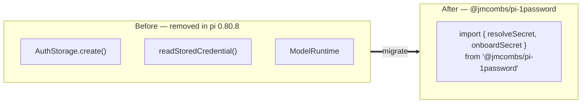

# Upgrade guide — migrating to the `@jmcombs/pi-1password` credential API

This guide is for **existing users** upgrading their installed extensions. It
covers, in one place, what changed across all four credential-using extensions
— [context7](../../packages/context7/README.md),
[tavily-search](../../packages/tavily-search/README.md),
[grok-search](../../packages/grok-search/README.md), and
[headroom](../../packages/headroom/README.md) — and what (if anything) you need
to do.

**The short version:** this is a feature enhancement, not a breaking change. Your
existing keys keep working, the new dependency installs itself, and the only
optional step is enabling the 1Password extension if you want vault-backed
credentials and the startup unlock.

- [What changed and why](#what-changed-and-why)
- [Before and after](#before-and-after)
- [What this means across all four extensions](#what-this-means-across-all-four-extensions)
- [Your existing keys keep working](#your-existing-keys-keep-working)
- [Enable the 1Password extension (vault integration + startup unlock)](#enable-the-1password-extension-vault-integration--startup-unlock)
- [Upgrade steps](#upgrade-steps)
- [Per-extension details](#per-extension-details)
- [See also](#see-also)

## What changed and why

pi 0.80.8 removed the exported pieces these extensions used to read your
credentials — the `AuthStorage` class (and its `AuthStorage.create()`
constructor), the `readStoredCredential()` helper, and `ModelRuntime`. Any
extension that called them stopped building against current pi.

Rather than each extension re-implementing secret handling, credential access is
now centralized in the **`@jmcombs/pi-1password`** extension, which exports a
small, stateless credential API. The four consumers declare it as a hard
dependency and import two functions from it — `resolveSecret` (resolve a key when
a tool needs it) and `onboardSecret` (collect a key when one is missing). Because
it is a normal dependency, it installs automatically with each extension; there
is nothing extra to add by hand.

## Before and after



## What this means across all four extensions

All four migrated extensions now share the same credential behavior:

- **Onboarding branches on 1Password availability.** When the `op` CLI is
  installed and an account is configured, each extension's `<name>_setup` command
  opens a live 1Password **vault → item → field picker** (or accepts a typed
  `op://…` reference), stored as an `!op read '…'` entry that resolves fresh on
  every use. When `op` is not available, onboarding falls back to **masked manual
  key entry**.
- **Keys resolve fresh on each use.** Rotating a key in 1Password takes effect
  immediately, with no restart.
- **The key is never shown to the model.** Entry happens entirely in the TUI, and
  only the resolved value is used to call the third-party service.

The onboarding **UX changed** — a vault picker where it used to be plain text
entry — but the trigger is the same: run the setup command, or let a tool prompt
you on first use.

## Your existing keys keep working

**No migration action is required for your credentials.** Any keys already in
`~/.pi/agent/auth.json` continue to resolve unchanged after you upgrade:

- **Literal keys** — a plain API-key string stored under the extension's logical
  name.
- **`!op read` references** — an `!op read 'op://vault/item/field'` entry, or any
  other `!`-prefixed shell reference (macOS Keychain, `pass`, and the like).

You do not need to re-enter, re-format, or move any existing key. The new resolver
reads both the current provider-shaped entries and older bare-string entries
transparently.

## Enable the 1Password extension (vault integration + startup unlock)

Installing and enabling **`@jmcombs/pi-1password`** is optional — the consumer
extensions pull it in automatically as a dependency so their code can import it —
but enabling it as an extension in its own right unlocks two things:

1. **Vault integration during onboarding.** With the extension enabled and `op`
   configured, the setup commands offer the live vault picker instead of only
   manual entry.
2. **Startup warm-up (the biometric prompt lands once).** The extension runs a
   `session_start` warm-on-load step: if any `!op read` reference exists in your
   `auth.json`, it performs **one** `op read` at startup to unlock the 1Password
   session. That way the Touch ID / biometric prompt appears a single time at the
   start of a session, and later credential resolves during the session are
   silent. Without it enabled, the first tool that needs a vault-backed key
   triggers the prompt instead.

To enable it:

```bash
pi install npm:@jmcombs/pi-1password
```

See the [`@jmcombs/pi-1password` README](../../packages/1password/README.md) for
its own setup and diagnostics.

## Upgrade steps

1. **Update the extensions.** Reinstalling or updating any of the four extensions
   pulls in the `@jmcombs/pi-1password` dependency automatically:

   ```bash
   pi install npm:@jmcombs/pi-context7
   pi install npm:@jmcombs/pi-tavily-search
   pi install npm:@jmcombs/pi-grok-search
   pi install npm:@jmcombs/pi-headroom
   ```

   (If you develop against a local checkout, `npm install` at the repo root
   reconciles the new dependency.)

2. **Do nothing to your existing keys** — they resolve as-is (see
   [above](#your-existing-keys-keep-working)).

3. **Optionally enable 1Password** for vault integration and the startup unlock
   (see [above](#enable-the-1password-extension-vault-integration--startup-unlock)).

4. **Optionally re-run a setup command** if you want to (re-)configure a key
   through the new onboarding flow — for example `/context7_setup` or
   `/headroom_setup`. This is only needed to change a key or move it into the
   vault; it is not required to keep an existing key working.

## Per-extension details

Each extension's own README documents its key name, resolution precedence, and
any environment-variable fallbacks — not repeated here:

- **[context7](../../packages/context7/README.md)** — logical key `context7`;
  Bearer-token auth to the Context7 API.
- **[tavily-search](../../packages/tavily-search/README.md)** — logical key
  `tavily`; retains the `TAVILY_API_KEY` environment-variable fallback.
- **[grok-search](../../packages/grok-search/README.md)** — resolves `xai_search`
  → `xai` → `grok` in precedence order (the shared real `xai` provider key is
  reused, never overwritten by setup).
- **[headroom](../../packages/headroom/README.md)** — logical key `headroom` for
  the optional proxy auth; base URL and key are resolved independently, and a
  local proxy usually needs no key at all.

## See also

- [Integration guide](./INTEGRATION.md) — how to adopt the credential API in a
  **new** extension of your own.
- [API reference](./API.md) — the full credential-API surface (`resolveSecret`,
  `onboardSecret`, and the advanced functions).
