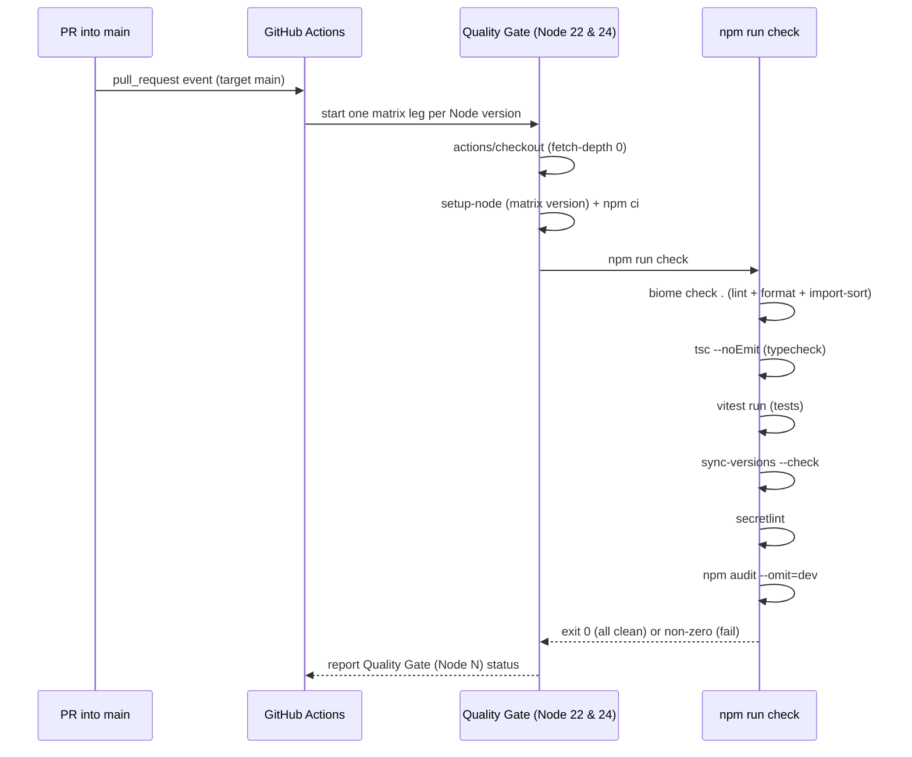
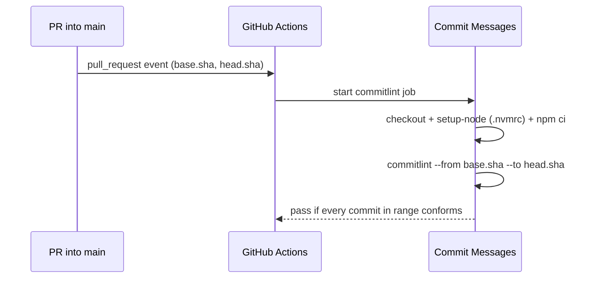
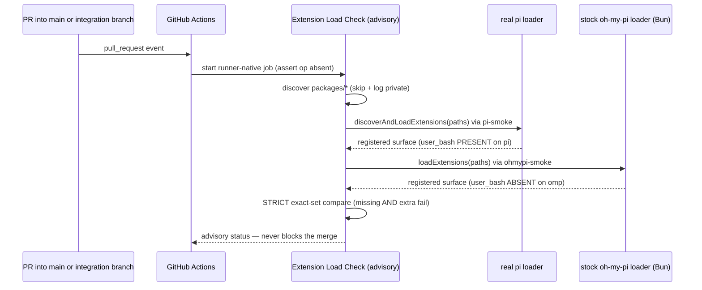
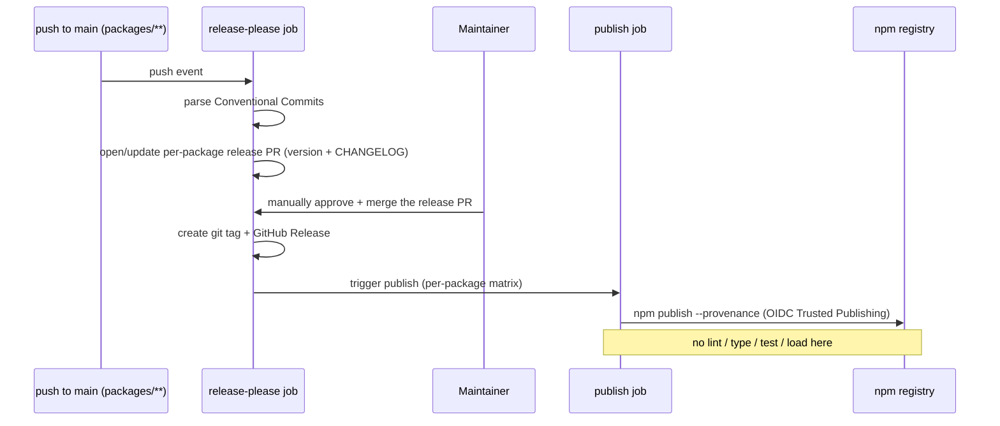

# Continuous Integration & Release

This page explains every automated check in this repository: what triggers it, what
it actually runs, and — for each one — what a green result **proves** and, just as
importantly, what it does **not** prove. Use it to answer "is this a *helpful* green?"
before you trust a checkmark.

The authoritative list of which checks are *required* to merge lives in
[`CONTRIBUTING.md` → Branch Protection](../CONTRIBUTING.md#branch-protection) (the
"Protect main" ruleset). This document does not duplicate that table — it references
it as the source of truth and explains what each check exercises.

## Mental model: is it a helpful green?

Three things run automatically, and they are not interchangeable:

- **Quality Gate** (required) — the `npm run check` pipeline, plus a commit-message
  check. Runs on **pull requests into `main`**. This is the gate branch protection
  enforces; a red here blocks the merge.
- **Extension Load Check** (advisory) — proves the shipped extensions still load and
  register their declared surface on both host runtimes. Runs on pull requests into
  `main` **and** into the `feat/1password-credential-api` integration branch. It is
  **informational only and never blocks a merge**.
- **Release Please** (post-merge automation) — after a merge to `main`, it opens
  release PRs and, once a maintainer merges one, tags and publishes to npm. It runs
  **no** code validation of its own.

The single most important thing to internalize: **CI runs on pull requests, not on
pushes.** The maintainer has an admin bypass and can push directly to `main`, and a
direct push **skips the entire Quality Gate**. A green history on `main` is only as
trustworthy as the PRs that produced it — always run `npm run check` locally before a
direct push.

## At a glance

| Workflow | File | Trigger | Required? | A green proves… |
| --- | --- | --- | --- | --- |
| Quality Gate | [`ci.yml`](../.github/workflows/ci.yml) | PR → `main` | **Yes** — `Quality Gate (Node 22)`, `Quality Gate (Node 24)` | the whole tree lints/formats/typechecks/tests clean on the pinned Node matrix, versions conform, no secret hits, no known prod-dep vulns |
| Commit Messages | [`ci.yml`](../.github/workflows/ci.yml) | PR → `main` | **Yes** — `Commit Messages` | every commit in the PR range matches Conventional Commits |
| Extension Load Check | [`extension-load.yml`](../.github/workflows/extension-load.yml) | PR → `main` **or** `feat/1password-credential-api` | No — **advisory** | every non-private extension loads + registers exactly its declared surface on pi and oh-my-pi with `op` absent |
| Release Please | [`release-please.yml`](../.github/workflows/release-please.yml) | push → `main` (on `packages/**` etc.) | n/a — post-merge automation | only that the release *mechanics* ran; **not** that any code is valid |
| 1Password shell-plugins updater | [`update-1p-shell-plugins.yml`](../.github/workflows/update-1p-shell-plugins.yml) | weekly schedule + manual dispatch | n/a — opens a PR | nothing directly; the PR it opens is gated like any other |
| Dependabot | [`dependabot.yml`](../.github/dependabot.yml) | weekly schedule | n/a — opens PRs | nothing directly; each PR it opens runs the full gate |

## Quality Gate

Defined in [`ci.yml`](../.github/workflows/ci.yml) as the `quality-gate` job, which runs
as a matrix across two Node versions and surfaces two separate required status checks:
**`Quality Gate (Node 22)`** and **`Quality Gate (Node 24)`**. Both must be green to
merge. The exact Node versions come from the matrix in `ci.yml`.

Each matrix leg checks out the repo, sets up the matrix Node version, runs `npm ci`,
then runs `npm run check`. That single script (defined in
[`package.json`](../package.json)) chains, in order:

1. **Lint** — `biome check .` (Biome's linter, which **includes formatting and
   import-sort** checks; there is no separate `format:check` step in this pipeline).
2. **Typecheck** — `tsc --noEmit` (via `scripts/typecheck.mjs`, a wrapper that
   no-ops cleanly when there are no TypeScript sources to check).
3. **Tests** — `vitest run`.
4. **Version validation** — `sync-versions --check`, which asserts each package
   conforms to the project's `package.json` conventions and registration.
5. **Secret scan** — `secretlint`.
6. **Dependency audit** — `npm audit --omit=dev`.

**A green here PROVES:** the whole tree lints, formats, and typechecks; import order is
clean; the test suite passes; every package conforms to the version/registration
conventions; `secretlint` finds no secret hits; and `npm audit` finds no known
**production**-dependency vulnerabilities — on *both* pinned Node versions.

**It does NOT prove:** that the extensions actually load on pi or oh-my-pi; any
runtime, tool, or command behavior; that `op`-backed credential resolution works;
anything about **dev**-dependency vulnerabilities (audit runs `--omit=dev`); or
anything at all about a **direct push to `main`**, which never triggers this workflow.

## Commit Messages

Defined in [`ci.yml`](../.github/workflows/ci.yml) as the `commitlint` job, surfaced as
the required status check **`Commit Messages`**. It checks out the repo, installs
dependencies, and runs `commitlint` over the PR's commit range (from the base SHA to the
head SHA) against the Conventional Commits ruleset in
[`commitlint.config.js`](../commitlint.config.js).

**A green here PROVES:** every commit message in the PR range conforms to Conventional
Commits (correct type/scope/subject shape) — which is what lets Release Please derive
versions and changelogs downstream.

**It does NOT prove:** anything about the code itself. A perfectly worded commit can
still fail the Quality Gate.

## Extension Load Check

Defined in [`extension-load.yml`](../.github/workflows/extension-load.yml) as the job
surfaced under the context **`Extensions load + register (pi + oh-my-pi, no op)`**. This
check is **advisory**: it is deliberately *not* in the "Protect main" required-check set,
so it can inform a review without ever blocking a merge. It triggers on PRs into `main`
**and** into the `feat/1password-credential-api` integration branch, so it guards both
while that migration is in flight.

In CI the check is **runner-native** — it drives each host's real loader directly on the
runner, with the 1Password CLI (`op`) absent. (The local
`npm run validate:extension-load` command is the *only* variant that builds a Docker
image; the CI job does **not** use Docker.)

The harness ([`docker/smoke-harness.mts`](../docker/smoke-harness.mts), driven by
`docker/pi-smoke.mts` and `docker/ohmypi-smoke.mts`):

1. **Discovers** every `packages/*` extension by reading each `package.json` and
   iterating its `pi.extensions` array; packages marked `private: true` are **skipped
   and logged** (never silently dropped).
2. **Loads on real pi** via `discoverAndLoadExtensions` (the exact loader pi uses at
   startup).
3. **Loads on stock oh-my-pi** via that fork's own `loadExtensions`, running under Bun.
4. **Compares each surface STRICTLY (exact-set):** for every category (tools, commands,
   handlers, shortcuts, providers) the registered members must *equal* the expected set —
   anything **missing** and anything **extra** both fail. Platform-aware differences are
   part of the expectation: `@jmcombs/pi-1password`'s `user_bash` handler is asserted
   **present on pi** (its host API exists) and **absent on oh-my-pi** (its compat shim
   omits that API). The complete expected surface per extension lives in
   [`CONTRIBUTING.md` → Expected surface per extension](../CONTRIBUTING.md#extension-load-check).

The Bun version and the oh-my-pi version the check installs are pinned in
`extension-load.yml`; the pi runtime comes from the repo's dev dependencies.

**A green here PROVES:** every non-private shipped extension links, loads, and registers
*exactly* its declared, platform-aware surface on both pi and stock oh-my-pi, with `op`
**absent** — so nothing is missing and nothing rogue was registered.

**It does NOT prove:** that `op`-backed credential **resolution** works (fetching a real
secret and using it); any tool or command **runtime behavior**; or onboarding/setup UX —
those remain manual, human checks. And because the check is advisory, a red result here
does **not** stop the merge; treat it as a signal to investigate.

## Release Please

Defined in [`release-please.yml`](../.github/workflows/release-please.yml). It triggers
on **pushes to `main`** that touch `packages/**` (or the release config/manifest/workflow
files) — i.e. *after* a PR has already merged.

It parses the Conventional Commits since the last release, opens or updates a per-package
release PR (bumping the version and updating that package's CHANGELOG), and then waits.
Nothing publishes until a **maintainer manually approves and merges** the release PR —
the release bot is intentionally *not* in the branch-protection bypass list, so every
publish is gated by an explicit human approval. Merging the release PR creates a git tag
and a GitHub Release, which triggers the `publish` job: `npm publish --provenance` via
**OIDC Trusted Publishing** (no stored `NPM_TOKEN`).

**What this AUTOMATES:** the release *mechanics* — version bumps, CHANGELOG entries,
tags, GitHub Releases, and provenance-signed npm publishes.

**What it does NOT do:** any lint, typecheck, test, or extension-load validation. Release
Please **trusts the Quality Gate that already ran on the source PRs**. If unvalidated code
reached `main` (e.g. via a direct push that skipped CI), Release Please will happily
publish it. Release PRs are merged manually precisely so a human is the last gate.

## Scheduled and dependency automation

Two more automations open PRs on a schedule. Neither has its own diagram because the
important part is simple: **whatever they open goes through the same Quality Gate as any
other PR.**

### 1Password shell-plugins updater

[`update-1p-shell-plugins.yml`](../.github/workflows/update-1p-shell-plugins.yml) runs on
a weekly schedule (and can be dispatched manually). It runs the updater script in
`--check` mode; if the curated 1Password shell-plugins list has drifted from the upstream
1Password docs, it refreshes the list and opens a `chore(1password):` PR for the
maintainer to review. That PR is then subject to the normal required checks.

### Dependabot

[`dependabot.yml`](../.github/dependabot.yml) watches two ecosystems — the npm workspace
and GitHub Actions — on a weekly schedule. Routine minor/patch bumps are **grouped** into
a single PR per ecosystem; **major bumps arrive as individual PRs** so breaking changes
get isolated review. Commit subjects use conventional prefixes (`chore(deps)`,
`chore(deps-dev)`, `ci(actions)`) so they pass the `Commit Messages` check. Every
Dependabot PR runs the full Quality Gate and requires maintainer approval — **nothing
auto-merges.**

## Gotchas

- **The required checks run only on PRs into `main`.** `ci.yml` triggers exclusively on
  `pull_request` targeting `main`. A PR into the `feat/1password-credential-api`
  integration branch therefore shows only the advisory Extension Load Check — the
  Quality Gate does not run there. The gate finally "bites" on the
  integration → `main` PR, which is where every required check must be green.
- **The Extension Load Check is advisory** — it never blocks a merge. A red load check is
  a prompt to investigate, not a hard stop.
- **CI in CI is runner-native, not Docker.** Only the local
  `npm run validate:extension-load` builds a container. Don't assume the CI job needs
  Docker.
- **Renaming a CI job or context name breaks branch-protection wiring.** The strings
  `Quality Gate (Node 22)`, `Quality Gate (Node 24)`, and `Commit Messages` are wired
  into the "Protect main" ruleset by name. Rename a job (or change the Node matrix) and
  the required check silently stops matching — protection quietly weakens. Keep the
  workflow job names and the ruleset in sync in the same change.
- **Version pins live in the YAML.** The Node matrix is in `ci.yml`; the Bun and
  oh-my-pi pins are in `extension-load.yml`; the release/commitlint runtime is `.nvmrc`.
  Bump them there, not in prose.
- **Publishing needs a per-package Trusted Publisher.** Each npm package must have an
  OIDC Trusted Publisher configured pointing at this repo and `release-please.yml`, and a
  brand-new package needs a one-time manual **bootstrap publish** first (OIDC cannot
  create a package that does not yet exist). See
  [`CONTRIBUTING.md` → Adding a New Extension](../CONTRIBUTING.md#adding-a-new-extension).
