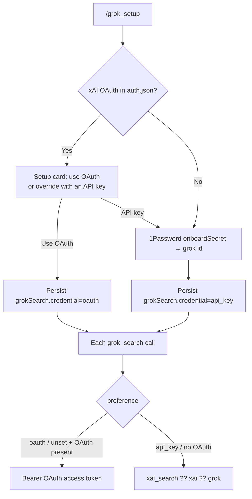

<div align="center">
  
  <br>
  <a href="https://www.npmjs.com/package/@jmcombs/pi-grok-search"></a>
  <a href="https://www.npmjs.com/package/@jmcombs/pi-grok-search"></a>
  <a href="https://opensource.org/licenses/MIT"></a>
  <a href="https://github.com/jmcombs/pi-extensions/stargazers"></a>
  <a href="https://github.com/jmcombs/pi-extensions/issues"></a>
  <a href="https://github.com/sponsors/jmcombs"></a>
</div>

# @jmcombs/pi-grok-search

> Real-time web search for the [Pi coding agent](https://pi.dev) via the
> [xAI Grok Agent Tools API](https://docs.x.ai/docs/guides/tools/overview).
> Registers `grok_search` for the model and `/grok_setup` for credentials.

## Quick Start

Get live Grok search in under a minute:

1. Install:

   ```bash
   pi install npm:@jmcombs/pi-grok-search
   ```

2. Authenticate. Either works:

   ```
   /login xai          # SuperGrok / X Premium OAuth — preferred if you already subscribe
   /grok_setup         # pick OAuth if Pi already has it, or onboard an API key
   ```

3. Ask for something past the model's cutoff. The agent calls `grok_search` on its own.

See the [Pi packages documentation](https://pi.dev/docs/packages) for git, local path,
project-scoped install, and filtering options.

## What It Adds

- **Tool**: `grok_search` — Grok-powered web search (`query`) via
  `POST https://api.x.ai/v1/responses` with `tools: [{ type: "web_search" }]`.
- **Command**: `/grok_setup` — if xAI OAuth is already in `auth.json`, a setup card
  offers **Use xAI OAuth** or **Use an API key instead**. Otherwise it runs the
  [`@jmcombs/pi-1password`](https://www.npmjs.com/package/@jmcombs/pi-1password)
  onboarding dialog. Input never reaches the model.

## How It Works

Each `grok_search` call sends a Bearer token. Which token is a persisted preference,
because OAuth and an API key can both exist:

1. **`grokSearch.credential`** in `~/.pi/agent/settings.json` (`oauth` or `api_key`),
   written by `/grok_setup`.
2. **OAuth** — Pi's `/login xai` SuperGrok / X Premium entry (`auth.json` `xai` with
   `type: "oauth"`). Used when the preference is `oauth` or unset. Expired access
   tokens are refreshed automatically.
3. **API key** — `resolveSecret("xai_search")`, then `resolveSecret("xai")` (API-key
   shaped only), then `resolveSecret("grok")`. Used when the preference is `api_key`,
   or when no OAuth is present.

If nothing resolves, first use auto-runs API-key onboarding. If you chose OAuth in
`/grok_setup` but the token is gone, the tool errors and asks for `/login xai` or
`/grok_setup` — it will not silently switch to an API key.



`/grok_setup` never overwrites the shared `xai` provider entry. API-key onboarding
writes the **`grok`** id.

## /grok_setup

```
/grok_setup
```

- **OAuth already present** — the card states that SuperGrok / X Premium was
  discovered and can be used. Keep it, or override with an API key.
- **API-key path** — the 1Password dialog: vault → item → field when `op` is
  configured, masked manual entry otherwise. Stored under `grok` so the `xai`
  provider credential stays untouched.

The chosen source is saved as `grokSearch.credential` in `settings.json`.

## After Setup

Talk to the agent normally. It will call `grok_search` when it needs current web
information.

## Configuration

### Preference

```json
{
  "grokSearch": {
    "credential": "oauth"
  }
}
```

`"api_key"` forces the API-key chain even if OAuth is still logged in.

### xAI OAuth

Written by `/login xai` (do not hand-edit tokens):

```json
{
  "xai": {
    "type": "oauth",
    "access": "…",
    "refresh": "…",
    "expires": 0
  }
}
```

### API key

Provider-shaped entries in `~/.pi/agent/auth.json`. Highest precedence first:
`xai_search`, then `xai` (API-key shape only), then `grok`. Literal or
`!op read 'op://…'`:

```json
{
  "grok": {
    "type": "api_key",
    "key": "!op read 'op://Personal/xAI/credential'"
  }
}
```

The `!`-prefixed value is resolved by the shell at lookup time.

## Behavior Notes

- Uses the xAI Responses + Agent Tools API (`web_search`).
- Honors Pi's abort signal — **Esc** cancels the HTTP request.
- Missing credentials and 401 / 429 / other non-2xx responses return as tool
  `content` (with status), never via a returned `isError` (which Pi ignores).

## Requirements

- Pi `>= 0.80.8` (credentials via the `@jmcombs/pi-1password` API and `ExtensionAPI`)
- Node `>= 22.19.0`
- xAI OAuth (`/login xai` SuperGrok / X Premium) **or** an xAI API key
- Optional: the `op` (1Password) CLI for vault-backed API-key onboarding

## Development

This package lives in the [pi-extensions monorepo](https://github.com/jmcombs/pi-extensions).
See `CONTRIBUTING.md` at the repo root for project conventions.

```bash
# From the repo root
npm ci
npm run check
npm run test -- packages/grok-search
```

To try local changes against a real Pi session:

```bash
pi -e ./packages/grok-search
```

Tests do **not** mock the xAI API. `index.test.ts` checks registration shape;
`auth.test.ts` / `setup.test.ts` exercise real temp `auth.json` / `settings.json`
and the setup card. Live search is `pi -e`.

## License

[MIT](./LICENSE) © Jeremy Combs
