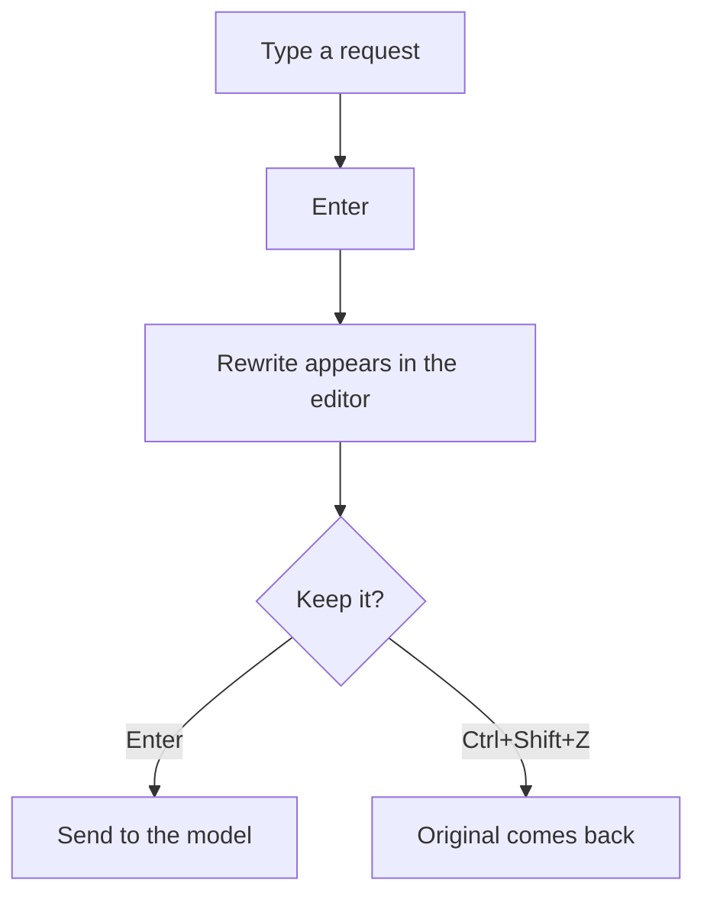

<div align="center">
  
  <br>
  <a href="https://www.npmjs.com/package/@jmcombs/pi-prompt-enhancer"></a>
  <a href="https://www.npmjs.com/package/@jmcombs/pi-prompt-enhancer"></a>
  <a href="https://opensource.org/licenses/MIT"></a>
  <a href="https://github.com/jmcombs/pi-extensions/stargazers"></a>
  <a href="https://github.com/jmcombs/pi-extensions/issues"></a>
  <a href="https://github.com/sponsors/jmcombs"></a>
</div>

# @jmcombs/pi-prompt-enhancer

> Codebase-aware prompt rewriting for the [Pi coding agent](https://pi.dev).
> It turns a rough request into a precise one, then puts that rewrite back in
> the editor for you to review. Nothing is submitted until you say so.

The enhancer looks at your project tree, git status, any files the draft names,
and the last few turns of the conversation, then **rewrites the request**
instead of answering it. The original stays one keystroke away.

That last part is what makes a follow-up work: "help me with this skill" can be
rewritten because the enhancer can see what "this" was. Only a small, capped
slice of the conversation is sent, and it is sent to the enhancer model — the
one shown on the status bar, which may not be the model running your session.

## Install

```bash
pi install npm:@jmcombs/pi-prompt-enhancer
```

See the [Pi packages documentation](https://pi.dev/docs/packages) for git, local
path, project-scoped install, and filtering options.

No extra API keys. It uses the model already active in your session, or one
you pick with `/prompt_enhance_model`.

## Quick start

1. Type a rough request.
2. Press `Ctrl+Shift+E`.
3. Read the rewrite. Nothing has been sent.
4. Press Enter to send, or `Ctrl+Shift+Z` for the original.

## Commands

| Command | What it does |
| --- | --- |
| `/prompt_enhance [text]` | Rewrite the text you pass, or whatever is already in the editor. |
| `/prompt_enhance_model` | Pick the enhancer model for the current session. Resets when Pi restarts. |
| `/prompt_enhance_revert` | Put the pre-enhance text back. Once only; also clears when you send a prompt. |
| `/prompt_enhance_auto` | Turn auto-enhance on or off for the current session. Off until you do. |

**Shortcuts** (also listed in `/hotkeys`):

- `Ctrl+Shift+E`: enhance what is in the editor. Always works, even when auto-enhance would skip.
- `Ctrl+Shift+Z`: revert the last enhance.

After an enhance, the footer reminds you how to revert. With auto-enhance on it
also says `Enter to send`. Press **Esc** to cancel an enhance that is still
running.

## When an enhance does not work

A slow or unreachable model is retried a few times first, and the loader names
the reason so you can decide to wait or press Esc:

```text
Retrying (1/3) in 2s… · Connection error
```

Esc cancels and changes nothing else. If the retries run out, three things
happen and nothing else:

- your prompt goes back in the editor, exactly as you typed it;
- auto-enhance turns itself off for the rest of the session, so the next Enter
  sends — turn it back on with `/prompt_enhance_auto`;
- one message says so, and names the reason:

```text
prompt enhancement failed (Connection error); your prompt is unchanged
```

## The status bar

Prompt Enhancer displays in the Pi status bar with the enhancer model, when
auto-enhance is enabled, and a short status after an action is taken. Here are
the elements of the status bar:

- **Ready**: a model is resolved. Enhance with `Ctrl+Shift+E`.
- **Auto on**: `/prompt_enhance_auto` is armed. Enter rewrites; Enter again sends.
- **No model**: pick one with `/model` or `/prompt_enhance_model`.
- **Review**: a rewrite is in the editor and has not been sent. `Ctrl+Shift+Z` restores the original.

<div align="center">
  
</div>

A [Nerd Font](https://www.nerdfonts.com/) is required for the mark and
separators to render.

## Auto-enhance on Enter

Off by default. Run `/prompt_enhance_auto` to turn it on for the current session. A
green `auto` block on the status bar means it is on.



Short replies like `ok`, `yes`, `approved`, or a brief answer to a question
are skipped. To enhance those anyway, use `Ctrl+Shift+E`.

## Requirements

| | |
| --- | --- |
| **Node** | ≥ 22.19.0 |
| **[Pi](https://pi.dev)** | any recent version |
| **A [Nerd Font](https://www.nerdfonts.com)** | for the status bar mark and separators |
| **A configured model** | at least one Pi model with an API key |

## Development

This package lives in the [pi-extensions monorepo](https://github.com/jmcombs/pi-extensions).
See `CONTRIBUTING.md` at the repo root for project conventions.

```bash
# From the repo root
npm ci
npm run check
npm run test -- packages/prompt-enhancer

# Try local changes (skip globally installed extensions so they do not collide)
pi --no-extensions -e ./packages/prompt-enhancer
```

## License

[MIT](./LICENSE) © Jeremy Combs
